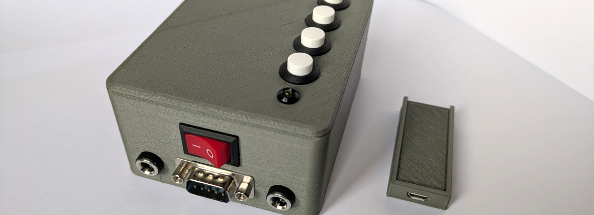
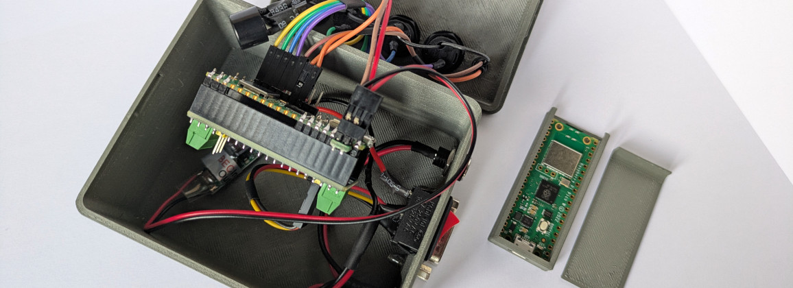
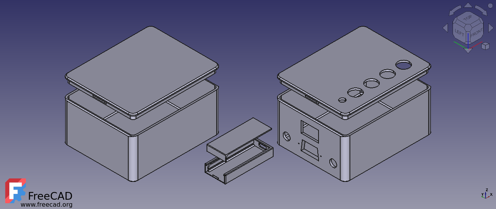

# Scale 2 POS (scale2pos)

The goal of this project is to connect a retail scale to a POS (point-of-sale) system using 2 Raspberry Pi Pico W.

The scale has an RS-232 port that is normally connected directly to the POS, but in this case it is connected to an RPi that reads the weight from the scale and transmits it to the other RPi (over Wi-Fi), the second RPi inputs the weight (and product code) on the POS. This removes the need for the scale and POS to be physically connected.

> This is a very specific project to solve a very specific problem. I don't expect it to be useful to anyone as is, but it has some components that can be used on other projects:
>
> - [mpy-ctrl.sh](mpy-ctrl.sh): A bash script to setup and manage any MicroPython project;
> - [src/utils](src/utils): Generic MicroPython utilities ([net.py](src/utils/net.py) is a nice one);
> - [3D Models](#3d-models-for-3d-printing): Project box models for 3D printing;
>
> This was my first project in MicroPython and served as my introduction to the platform. &mdash;goncalomb

## Images

Final device images ([images/](images/)):





## Requirements / Setup

"Client" RPi (scale):

- Connects to the scale using RS-232;
- Connects to the "server" using Wi-Fi;
- Powered by 12V (shared with the scale, 2.1mm jack);
- Has a buzzer for audio feedback;
- Has a set of push buttons for different product codes;
- Reads the weight from the scale and transmits it to the "server" (Web API), together with the product code as a barcode with embedded weight;

"Server" RPi (POS):

- Connects to the POS using USB;
- Acts as a USB keyboard;
- Acts as a Wi-Fi access point and web server (HTTP);
- Receives and emulates keyboard codes, the POS interprets these inputs as barcodes and registers the product;

## Hardware

This is a non-exhaustive list, there is no custom PCB or schematic:

- 2x [Raspberry Pi Pico W](https://www.raspberrypi.com/documentation/microcontrollers/pico-series.html);
- 1x [Waveshare Pico-2CH-RS232](https://www.waveshare.com/wiki/Pico-2CH-RS232);
- 2.1mm panel jacks, power switch, diode (1N4007), UBEC (5V/3A);
- 3V buzzer (TMB12A03), transistor (2N3904), resistor (1k);
- Yellow LED, resistor (1k);
- Generic push buttons, wires, etc.;

## Software (MicroPython)

The code is managed and installed using the custom `mpy-ctrl.sh` script. The variant is selected when pushing the code:

```bash
# setup environment and download dependencies
./mpy-ctrl.sh setup

# install the "client" variant (scale)
./mpy-ctrl.sh push client

# install the "server" variant (POS)
./mpy-ctrl.sh push server

# install the "serial-debug" variant (interactive serial debug console)
./mpy-ctrl.sh push serial-debug
```

## 3D Models (for 3D printing)



Project box models for 3D printing ([models/](models/)). The "Pico Box" (in the middle) is for the "server". The big box is for the "client".

> You may use these models for your own projects!
>
> The "Pico Box" is just a plain box that fits the Raspberry Pi Pico perfectly, no screws, the RPi and the lid slide from the back, ideal when you don't need any IO, just a USB connection. The big box can also be used as a generic project box.
>
> The parametric FreeCAD project is also available ([models/scale2pos.FCStd](models/scale2pos.FCStd)). License: [CC BY-SA 4.0](https://creativecommons.org/licenses/by-sa/4.0/).
>
> I'm still learning FreeCAD, these are my first published models. &mdash;goncalomb

## References

Reference documents ([references/](references/)), most important:

- [tw-vw-protocols-v5.pdf](references/tw-vw-protocols-v5.pdf): retail scale serial protocols (Baxtran);
- [Standard-GS1-PT-Codificacao-Produtos-Peso-Variavel.pdf](references/Standard-GS1-PT-Codificacao-Produtos-Peso-Variavel.pdf): variable weight barcode format (in Portuguese);

## License

### 3D Models

Creative Commons license: [CC Attribution-ShareAlike 4.0](https://creativecommons.org/licenses/by-sa/4.0/).

### Software

scale2pos is released under the terms of the MIT License. See [LICENSE.txt](LICENSE.txt) for details.
